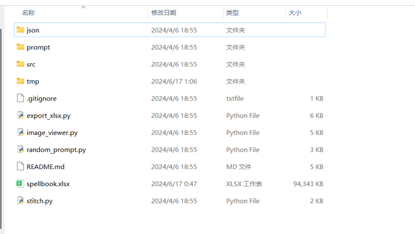
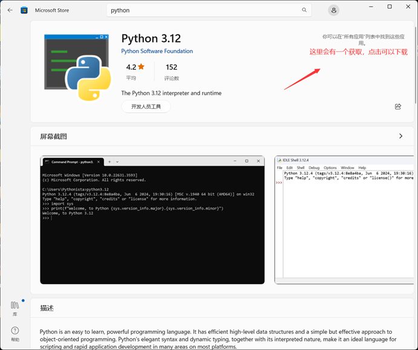
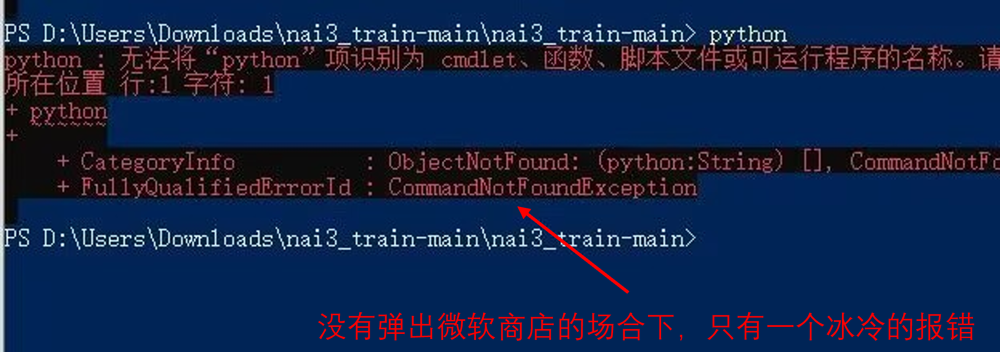
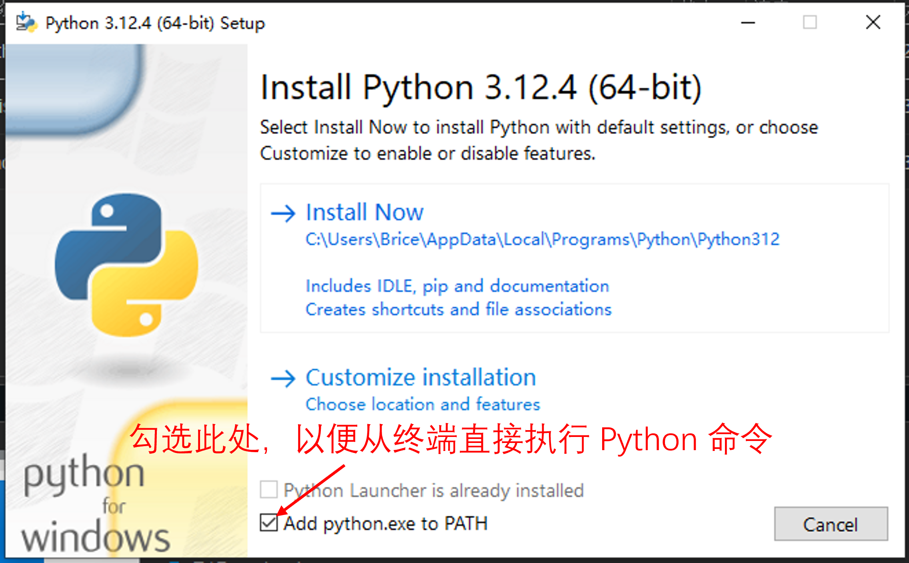
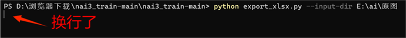
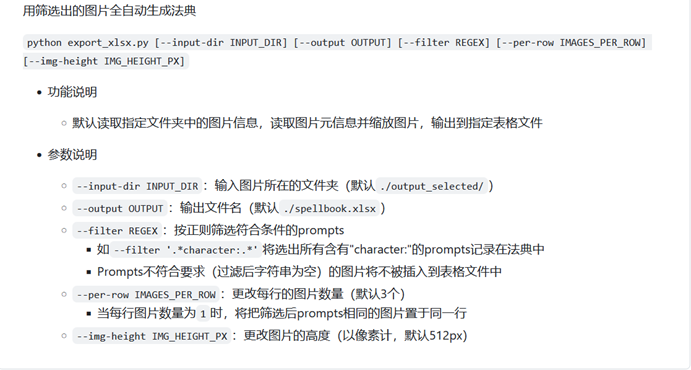

## 提取图片 tag 到 xlsx 表格 · 图文攻略版

- **代码下载**

    打开[此链接](https://github.com/Exception0x0194/nai3_train)，下载包含源码的压缩包。

    

    下载完毕后，将内容解压到本地。

- **打开终端**

    在源码的解压目录，用 `shift + 鼠标右键`，在弹出菜单中点击`在此打开 powershell 窗口`。

    

- **安装 Python 以及依赖项**

    在终端输入 `python` 并回车，如果没有安装 Python，可能会出现两种情况：
    
    - 可能弹出 Python 微软商店界面，此时可以点击获取以安装 Python。

        

    - 可能只有命令行报错，没有弹出微软商店界面，此时需要访问 [Python 官网](https://www.python.org/)，手动安装 Python 解释器。在安装时，需要注意勾选 `add python to PATH`，以便从终端执行 Python 相关指令。

        
        
        

    安装完成后，重新打开终端，执行 `python -m pip install pillow openpyxl` 以安装运行加脚本所需的依赖项。

- **导出 xlsx 表格**

    在终端输入 `python export_xlsx.py --input-dir 【】`

    其中，`【】` 应当修改为存放图片的文件夹路径。如果输入指令之后，Python 自动换行无反应，是正在加载，请耐心等待。

    

    - **更多参数**

        默认情况下，导出的表格每行 3 个图片，图片高度 512px。通过提供更多参数，可以修改这些数值，比如 `python export_xlsx.py --input-dir 【】 --per-row 5` 就可以指定每行 5 张图，在屏幕较大时会比较有用。

        更多参数和作用可以参照项目 README 文件内容：

        

攻略编著者：苍凉如梦
